# MythConf Accessibility Submission

This pull request turns the MythConf conference app into a more inclusive, assistive-technology-friendly schedule app while keeping the original conference-app feel. The work focuses on the iOSDevUK Accessibility Challenge judging categories: vision, mobility, cognitive accessibility, overall quality, creativity, and the optional hearing and speech bonus categories.

The original challenge app was a compact SwiftUI conference schedule with Programme, Speakers, Locations, My Schedule, and Favourites. This submission keeps that product shape, but adds a full accessibility layer across the real conference tasks: finding a talk, understanding when it starts, saving it, getting reminded, navigating to rooms, and using the app without relying only on touch or sight.

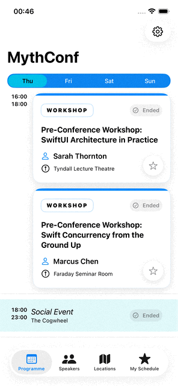

## Benefits At A Glance

| User benefit                                  | Original experience                       | Improved experience                                                                                              |
| --------------------------------------------- | ----------------------------------------- | ---------------------------------------------------------------------------------------------------------------- |
| Find and save talks with less effort          | Dense cards with confusing nested targets | One clear card target, separate favourite action, and structured metadata                                        |
| Understand a session quickly                  | Sparse detail page with weak hierarchy    | Time, location, speaker, description, and favourite action are visually and semantically clear                   |
| Know whether a favourite action worked        | Mostly visual state change                | Visual, VoiceOver, haptic, sound, and optional spoken fallback feedback                                          |
| Stay oriented in the schedule                 | Users calculated time from raw timestamps | Status badges, countdowns, Now/Next chips, reminders, and spoken-friendly times                                  |
| Read long content more comfortably            | System font only                          | Optional OpenDyslexic for descriptions and biographies                                                           |
| Use the app without relying on touch or sight | Visual navigation required                | VoiceOver, Voice Control, Siri, Magic Tap, rotors, and custom actions                                            |
| Use personal accessibility display settings   | Some states relied on visual styling      | Native toggles, Button Shapes support, Reduce Transparency fallbacks, grayscale-safe states, and non-colour cues |
| Trust accessibility does not regress          | Manual inspection only                    | Static linting, runtime UI audits, semantic UI tests, and deterministic time injection                           |

## From Original App To Submission

I kept a copy of the original challenge project locally while preparing this PR so I could compare what was supplied with the final app.

| Original Challenge App                  | This Submission                                                                                                                                                    |
| --------------------------------------- | ------------------------------------------------------------------------------------------------------------------------------------------------------------------ |
| 29 Swift source files in the app target | 43 Swift source files in the app target                                                                                                                            |
| No UI test target                       | 8 UI test files covering accessibility-sensitive flows                                                                                                             |
| No Settings screen                      | Settings for OpenDyslexic, haptics, sounds, and reminder timing                                                                                                    |
| No App Intents or Siri shortcuts        | Reliable Siri/Shortcuts actions for reading the saved schedule, getting session details, and opening directions, plus searchable session results that open details |
| No TipKit onboarding                    | Contextual tips for favourite, day switching, speaker search, and Maps                                                                                             |
| No local notification system            | Configurable local reminders for favourited sessions                                                                                                               |
| No sound assets                         | Distinct add/remove favourite sounds                                                                                                                               |
| Basic schedule cards and detail screens | Redesigned cards/details with assistive technology semantics                                                                                                       |
| No deterministic test clock             | `-TestingDate` injection for time-based accessibility states                                                                                                       |
| No automated accessibility gate         | Static `a11y-check` linting plus XCTest `performAccessibilityAudit` UI tests                                                                                       |

This work landed through more than 100 small commits. The intent was to improve the app incrementally, verify each change, and avoid one large risky rewrite.

## Why The Added Packages And Tools Are Here

The package and tooling choices are intentionally narrow. Each one supports a specific accessibility outcome instead of adding general infrastructure for its own sake.

- **FontKit** is used for the optional OpenDyslexic reading mode. It lets the app apply OpenDyslexic through scalable SwiftUI font APIs instead of hard-coded custom font sizes, so dyslexia support can coexist with Dynamic Type.
- **Point-Free Dependencies** is used to inject time, with its test-support product available to the test target. Many accessibility features depend on the current conference moment: Starting Soon, Starting in Xm, Live, Ended, Now/Next chips, spoken status, and reminder scheduling. Injecting time lets UI tests and judges see real moving conference-day states without waiting for the actual event date or freezing the UI.
- **TipKit** is used because several accessibility improvements are discoverability problems, not just label problems. Tips teach existing controls such as saving sessions, switching days, finding speakers, and opening Maps at the moment those controls are relevant, then get out of the way.
- **a11y-check** is used as a fast static accessibility linting layer. It catches source-level problems such as missing labels, small hit targets, and trait issues before manual testing.
- **XCTest `performAccessibilityAudit`** is used as the runtime layer. It validates the real app screens after SwiftUI has built the accessibility tree, catching issues static linting cannot see.
- **No SocialSymbols package** is used for speaker social icons. Supported social/community logos are local SF Symbol assets in `Assets.xcassets`, which keeps the submission smaller and avoids a dependency for decorative iconography.

## Benefits For Judges To Try

### 1. Faster Schedule Scanning Without Losing The Original Design

**Benefit:** Attendees can scan, open, and save sessions faster, including when using VoiceOver, Voice Control, Switch Control, or large text.

The Programme and My Schedule screens keep a recognisable conference schedule layout, but the interaction model is clearer and less fatiguing.

- Session card is the primary navigation target.
- Favourite star remains a separate 44 x 44 point control.
- Card includes custom accessibility actions for adding or removing favourites.
- VoiceOver gets concise primary labels plus structured custom content for speaker, location, time, status, and favourite state.
- Voice Control gets speakable input labels such as "Star", "Favourite", and title-specific alternatives.
- Cards reflow at accessibility text sizes instead of squeezing long titles into unusable columns.
- Parallel sessions stack on compact screens rather than becoming narrow unreadable columns.
- Session category, favourite state, and live/upcoming/ended status are not colour-only. They are expressed through visible text, symbols, shape, accessibility values, and custom content.
- Cards adapt for Reduce Transparency by using opaque system surfaces instead of low-opacity tinted backgrounds.

| Before                                                                     | After                                                                    |
| -------------------------------------------------------------------------- | ------------------------------------------------------------------------ |
| 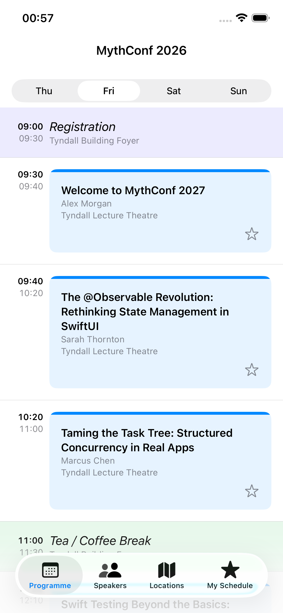 | 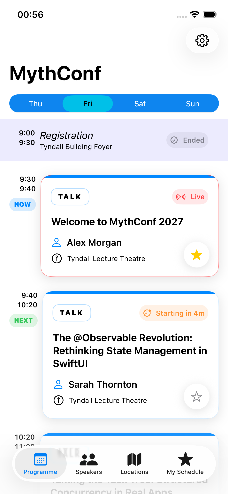 |

### 2. Session Details That Answer The Attendee's Questions

**Benefit:** A user can answer "What is this?", "When is it?", "Where is it?", "Who is speaking?", and "Do I want this in my schedule?" without hunting around.

The Session Details screen was redesigned around the most important real-world conference tasks: understand the session, find the room, learn about the speaker, and add or remove the session from favourites.

- The original detail screen was visually sparse and did not make the favourite action, metadata, or speaker relationship strong enough for assistive technology users.
- Uses a standard inline navigation title: "Session Details".
- Favourite star lives in the toolbar for fast access.
- Body includes large readable title, explicit Time and Location rows, speaker card, and About This Session section.
- Full-width Add/Remove Favourite button gives a clear action for users who do not recognise the star icon.
- VoiceOver Magic Tap toggles favourite state from anywhere on the detail screen.

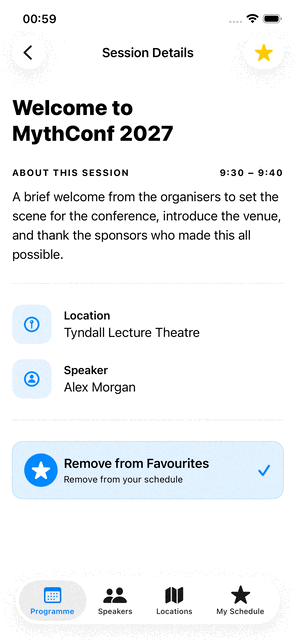

### 3. Less Mental Math For Time-Sensitive Navigation

**Benefit:** Users who struggle with time blindness, cognitive fatigue, or fast venue changes get an immediate answer to "what is happening now and what is next?"

Conference schedules are time-sensitive. This PR gives multiple time anchors without requiring users to compare the current time against every row.

- The original app showed raw times. Users had to compare the current time against every row themselves.
- Session status badges show states such as Starting Soon, Starting in 8m, Live, and Ended.
- VoiceOver expands compact labels, for example "Starting in 8 minutes".
- Now and Next chips appear beside the time column to anchor the user in the current schedule.
- "Next" only appears when there is a visible "Now" item in the same schedule context, so a future session is not mistaken for the current anchor.
- The status badge says "Live" while the row chip says "Now", separating session state from schedule position.
- Ended sessions are visually de-emphasised.
- Local reminders can notify users before favourited sessions start.
- Reminder timing is user-controlled: Off, 5 minutes, 10 minutes, or 15 minutes.
- The app can be launched with injected conference dates, so judges can see the exact mix a real attendee would see during the event: ended sessions, the live session, upcoming sessions, countdowns, Now/Next chips, and reminders.

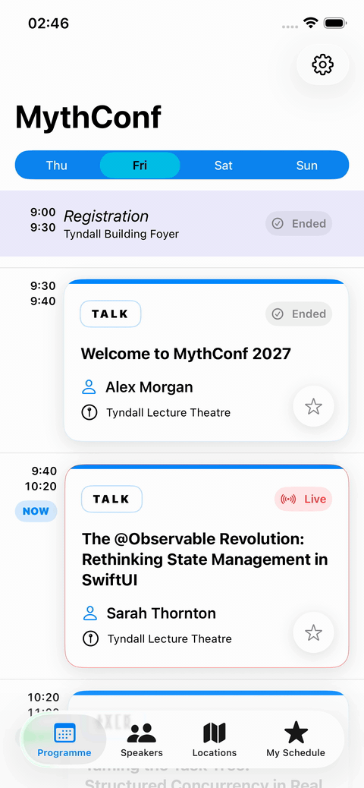

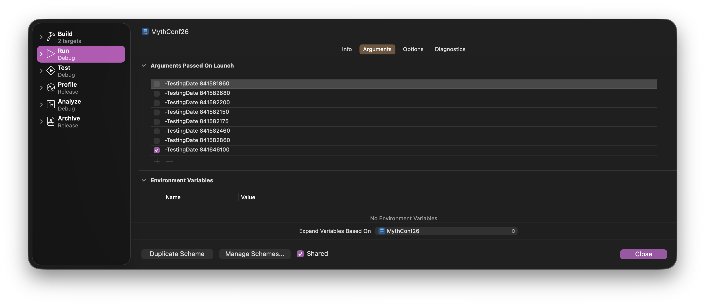

### 4. VoiceOver Navigation That Scales To A Dense Programme

**Benefit:** VoiceOver users can jump through the schedule by purpose instead of swiping through every visible element.

This work goes beyond adding labels. It improves how VoiceOver users move, inspect, and act in dense schedule screens.

- Dense screens were reviewed as navigable schedules, not just as individual controls.
- Custom VoiceOver rotors for dense schedule navigation:
  - Live Sessions
  - Upcoming Sessions
  - Favourited Sessions
  - Breaks
- `accessibilityCustomContent` exposes structured metadata without making every card announcement too long.
- Time ranges use spoken-friendly phrasing:
  - Upcoming: "Starts at 09:30. Ends at 09:40."
  - Live: "Started at 09:30. Ends at 09:40."
  - Ended: "Started at 09:30. Ended at 09:40."
- Speaker and location rotors were investigated and intentionally removed. SwiftUI rotor navigation announces the target card's own label after jumping, so those rotors promised speaker/location context that VoiceOver did not actually speak. Speaker and room discovery now stays in the dedicated Speakers and Locations tabs, while cards expose speaker and location through custom content.
- Speaker detail headings now include context, for example "Sessions by Alex Morgan".
- Decorative images are hidden and meaningful speaker photos have contextual labels.

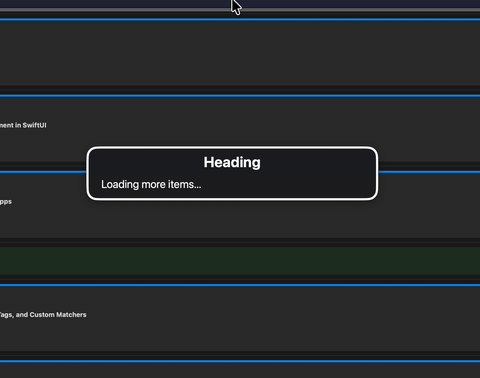

### 5. Speech Access For Core Conference Tasks

**Benefit:** Users can operate core flows by voice, either by targeting visible controls with Voice Control or by asking Siri to perform app actions.

The app supports spoken interaction in two layers:

1. Voice Control labels and input labels for visible UI.
2. Siri/App Intents for voice-first workflows.

Users can target visible controls with natural phrases such as:

- "Tap Star"
- "Tap Favourite"
- "Tap Welcome to MythConf 2027"
- "Tap Speakers"
- "Tap My Schedule"

Siri focuses on reliable conference workflows: reading the user's saved schedule aloud, getting details for a selected session, and opening directions to a selected session location. Users favourite sessions in the visual app, with VoiceOver, Magic Tap, or Voice Control. Siri then provides hands-free ways to hear what has been saved or ask for the next piece of conference information.

Separately, sessions are indexed as searchable App Entities. A user can search by title, speaker, location, or day in system search, then tap a session result to open the matching Session Details screen. This helps users who know what they want but do not want to visually scan the full programme. It is useful for VoiceOver users, Voice Control users using system search, keyboard users, and users with cognitive fatigue who remember a talk title or speaker name.

Example phrases:

- "Hey Siri, read my schedule in iOSDevUK"
- "Hey Siri, what is on my schedule in iOSDevUK"
- "Hey Siri, read saved sessions in iOSDevUK"
- "Hey Siri, get session details in iOSDevUK"
- "Hey Siri, get directions to a session in iOSDevUK"

All recommended Siri examples use `iOSDevUK`. Siri struggled with `MythConf`, `Myth Con`, and similar pronunciations during testing, so the submission documentation avoids asking judges to say those names.

The session-specific Siri actions are picker-driven: the initial phrase does not contain a session title. Siri asks which session and presents searchable options. This avoids fragile spoken title matching while still letting users hear details or get directions with fewer taps.

Siri responses are designed for voice-only use and visual glanceability. `Read Schedule` and `Session Details` use full spoken dialog for no-display contexts and compact snippet views when a display is available. Spoken times use clear phrases like "Start time 09:30. End time 09:40." instead of compact visual punctuation.

| Shortcuts                                                                      | Siri                                                                  |
| ------------------------------------------------------------------------------ | --------------------------------------------------------------------- |
| 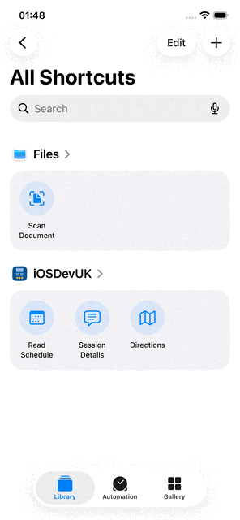 | 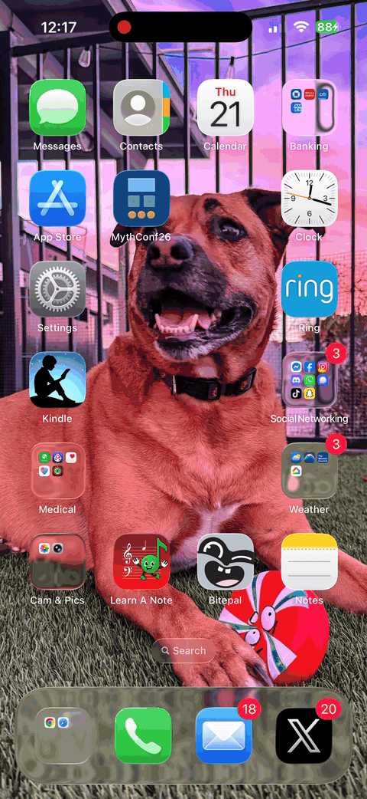 |

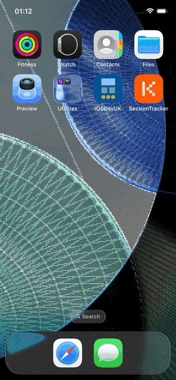

### 6. Lower Reading Friction For Long Text

**Benefit:** Users with dyslexia or visual reading fatigue can opt into a font treatment where it helps most, without destabilising compact schedule UI.

Settings includes an optional OpenDyslexic reading mode.

The implementation is intentionally targeted:

- Applies OpenDyslexic to reading-heavy content such as descriptions and biographies.
- Keeps compact metadata, times, tabs, navigation titles, and controls in the system font to avoid layout breakage.
- Preserves Dynamic Type by using scalable FontKit APIs.
- Groups the Settings preview as a clear "Font preview" for VoiceOver.
- Announces preview updates to VoiceOver users when the setting changes.
- Leaves the setting off by default so users opt in only if it helps them.

| System Font                                                | OpenDyslexic Reading Mode                                |
| ---------------------------------------------------------- | -------------------------------------------------------- |
| 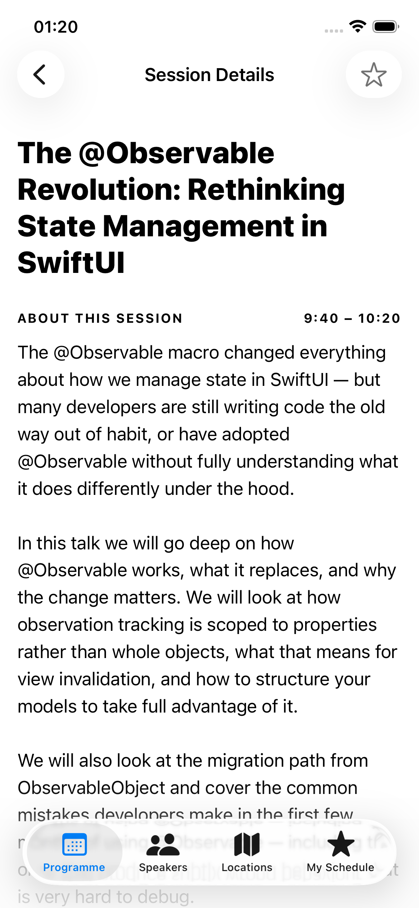 | 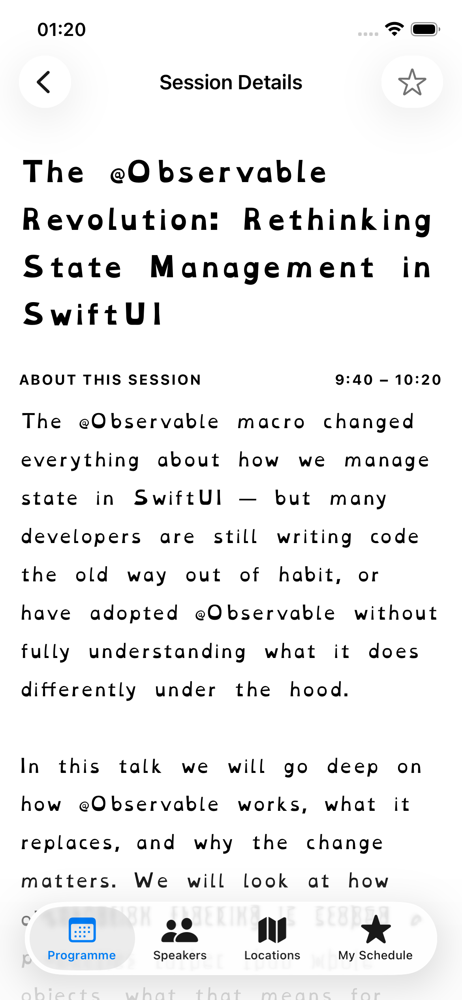 |

### 7. Confirmation That Does Not Depend On One Sense

**Benefit:** Users can tell whether a session was added or removed even if they cannot rely on sight, sound, or haptics alone.

Favouriting a session provides feedback through multiple channels:

- Visual selected/unselected star state.
- Haptic feedback:
  - Success feedback when adding a favourite.
  - Light impact when removing a favourite.
- Sound feedback:
  - Bell sound when adding a favourite.
  - Pop sound when removing a favourite.
- Spoken VoiceOver fallback announcement when both haptics and sounds are disabled.
- Settings toggles for haptic feedback and sound feedback, both on by default.
- Favourite add/remove announcements are intentionally a fallback, so VoiceOver users do not get duplicate spoken confirmations when haptics or sounds are already enabled.

This supports users who may not perceive one feedback channel reliably, while still allowing users with sensory sensitivity to disable feedback.

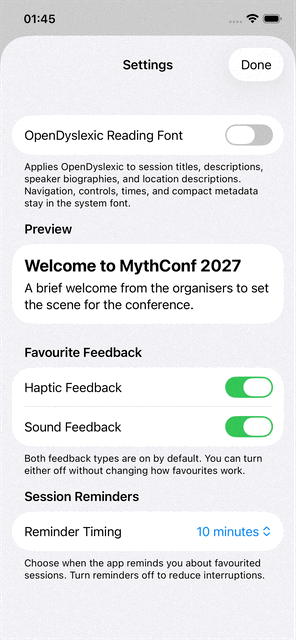

### 8. User-Controlled Reminders Instead Of One-Size-Fits-All Alerts

**Benefit:** Users can choose the reminder pattern that supports them without creating unwanted interruption or sensory load.

Favourited sessions can create local notifications before the session starts. Users control the reminder timing in Settings:

- Off
- 5 minutes
- 10 minutes
- 15 minutes

Accessibility benefits:

- Helps users with ADHD or time blindness transition between sessions.
- Gives VoiceOver users reliable system-level announcements, even from the lock screen.
- Avoids forcing a single interruption pattern on everyone.
- Never schedules reminders for past sessions.
- Notification taps deep-link back to the relevant session.

| Reminder Setting                                           | Local Notification                                             |
| ---------------------------------------------------------- | -------------------------------------------------------------- |
|  | 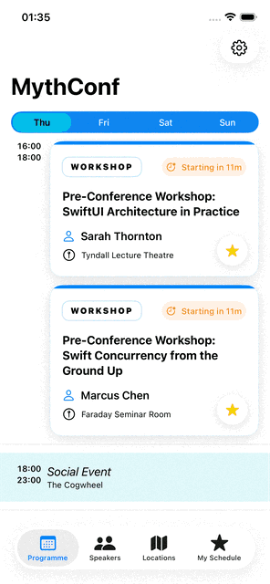 |

### 9. More Predictable Room Navigation

**Benefit:** Users can move from a room description to Apple Maps with a clear, announced transition instead of an unexplained app switch.

Location detail screens include a visible Open in Maps button.

- The action is available visually and through VoiceOver custom actions.
- Button label includes the destination, for example "Open Tyndall Lecture Theatre in Maps".
- `AccessibilityNotification.Announcement` tells VoiceOver users that Apple Maps is opening before the app switches context.
- Speaker social links use the same announcement pattern before opening an external profile, so VoiceOver users get a verbal bridge before Safari or another app takes focus.
- A Copy Link action is also available through the toolbar and VoiceOver Actions rotor, giving users a non-navigation alternative for sharing or opening the location URL elsewhere.
- The design uses a compact button so the action is discoverable without overwhelming the location page.

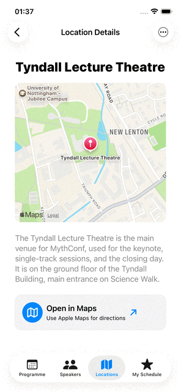

### 10. Discoverability Without A Tutorial Wall

**Benefit:** Users discover important controls at the moment they need them, without being forced through a separate onboarding flow.

The app teaches non-obvious features in context:

- Save Sessions tip on the favourite star.
- Switch Days tip on the Programme day picker.
- Find a Speaker tip on the Speakers screen.
- Open in Maps tip on location detail screens.

Tips are invalidated after the taught action is used, and hidden during UI tests so they do not destabilise automation.

| Save Sessions                                                                                   | Switch Days                                                                                       |
| ----------------------------------------------------------------------------------------------- | ------------------------------------------------------------------------------------------------- |
| 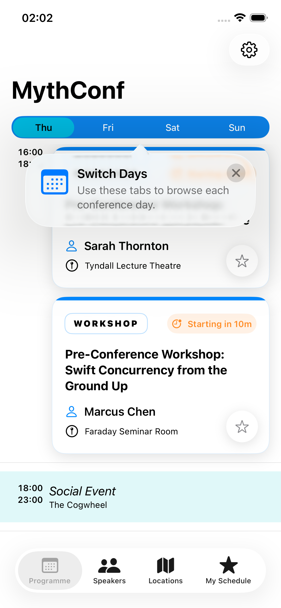 | 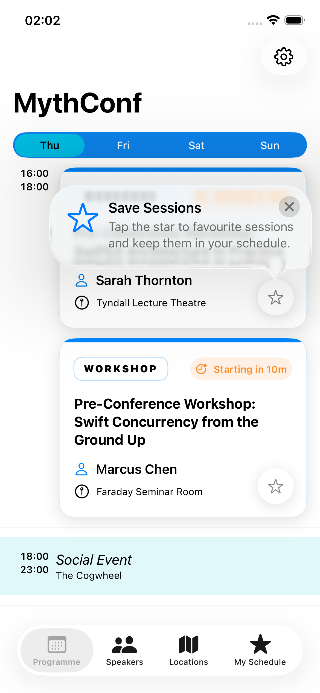 |

| Find A Speaker                                                                                   | Open In Maps                                                                                     |
| ------------------------------------------------------------------------------------------------ | ------------------------------------------------------------------------------------------------ |
| 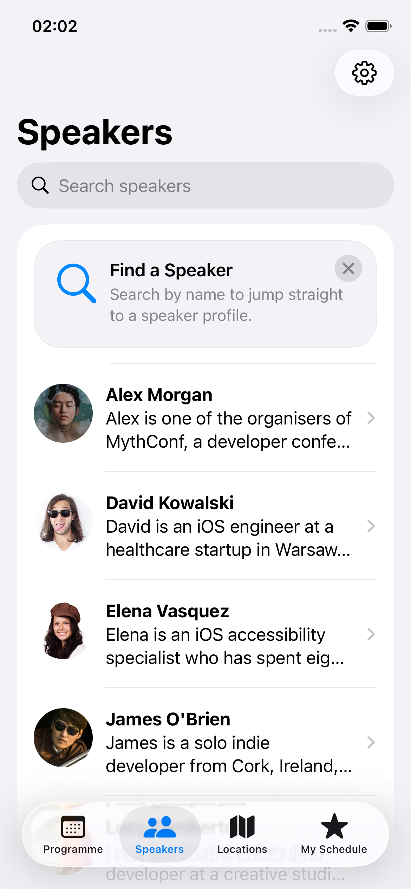 | 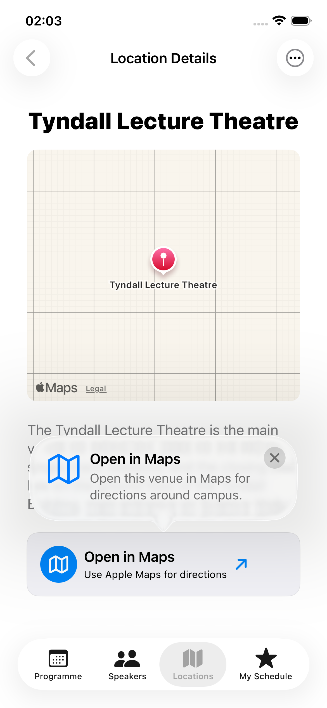 |

## Smaller Changes With Practical Benefits

These changes are smaller individually, but they remove friction across everyday app use:

- Settings uses native SwiftUI toggles for OpenDyslexic, haptic feedback, and sound feedback, so the system On/Off Labels setting is preserved.
- Settings controls use clearer hints that describe the result of changing the setting instead of repeating the current state.
- The Settings OpenDyslexic preview is treated as a visual font sample rather than live conference content for VoiceOver.
- Button Shapes support was added to custom icon-only and row-like controls such as Settings, favourite stars, social links, session detail rows, and location actions.
- Reduce Transparency fallbacks make schedule cards, break rows, and sticky My Schedule day headers use opaque system surfaces when requested.
- Differentiate Without Color and grayscale checks were addressed by making important states visible through text, symbols, shape, selected state, and accessibility values rather than hue alone.
- Speaker photos are decorative in lists when the adjacent text already identifies the speaker.
- Larger speaker detail photos use contextual labels such as "Photo of Sarah Thornton".
- Speaker search includes an empty state.
- Speaker social links use `AccessibilityNotification.Announcement` before opening an external link, so VoiceOver users are not surprised by a context switch to Safari or another app.
- Speaker session heading reads as "Sessions by [speaker name]".
- Location rows and detail screens have better grouping and Dynamic Type behavior.
- The map preview is summarised as one accessible element.
- Tab icons were made monochrome for more reliable contrast.
- Time formatting respects the user's 12-hour or 24-hour system preference.
- Settings sheet focus restoration was improved for most tabs.
- Reduce Motion disables favourite star replacement motion.
- Reduce Motion also disables the Session Detail favourite action state animation.
- Tips are hidden while VoiceOver is running where a popover would be more disruptive than helpful.
- Custom accessibility labels were simplified where category prefixes created noisy announcements. Session Detail titles/descriptions, speaker biographies, speaker session links, and location descriptions now read closer to visible text while context comes from role, value, hint, and navigation title.

## Judging Criteria Coverage

### Vision

- VoiceOver labels, hints, values, headings, custom content, Magic Tap, custom rotors, and spoken-friendly times.
- Dynamic Type reflow for dense schedule cards and speaker content.
- Reduce Transparency and Increase Contrast improvements.
- Button Shapes, On/Off Labels, Differentiate Without Color, and grayscale-friendly state communication.
- Reduced Motion support for favourite star transitions.
- Meaningful image labels and decorative image hiding.
- Optional OpenDyslexic reading mode.

### Mobility

- 44 x 44 point favourite targets.
- Visible Open in Maps action.
- Menu picker for reminder timing instead of cramped segmented controls.
- Magic Tap for the primary Session Detail action.
- Custom actions on cards to reduce navigation effort.
- Visible button affordances on custom controls when Button Shapes is enabled.
- Copy Link on location details as a non-navigation alternative to opening Maps.
- UI designed for future Switch Control and Full Keyboard Access passes.

### Cognitive

- Now/Next chips.
- Starting Soon / Starting in Xm / Live / Ended status.
- Local reminders with user-controlled timing.
- Reduced colour dependency for status, category, and favourite state.
- Clear Session Detail hierarchy.
- TipKit guidance for discoverability.
- OpenDyslexic option for long-form reading.

### Creativity

- Siri/App Intents for reliable voice-first saved-schedule, session detail, and directions workflows.
- Multi-sensory favourite feedback with settings controls.
- Time-aware cognitive supports using injected testing time.
- VoiceOver rotors tailored to real conference navigation.
- Multi-path location handoff: open in Maps or copy the location link.

### Quality

- Automated XCTest accessibility audit suite.
- Static accessibility linting with `a11y-check`.
- Stable accessibility identifiers for important flows.
- Focused UI tests for Settings, Session Details, favourites, reminders, status badges, and semantics.
- Deterministic UI test data and launch-time clock injection.
- No blanket audit ignores: known false positives are narrow and documented.
- Settings and display-accessibility behavior is documented for human review: On/Off Labels, Button Shapes, Reduce Transparency, Reduce Motion, Differentiate Without Color, and grayscale.

### Hearing Bonus

- Important favourite state changes are not sound-only.
- Haptic, visual, and spoken alternatives exist.
- Sound feedback can be disabled independently.

### Speech Bonus

- Voice Control input labels for visible UI.
- Siri/App Intents for reading saved sessions aloud, asking for session details, and getting directions to a selected session.
- Natural spoken Siri wording such as "your schedule".
- Voice-only responses for empty schedule, populated saved schedule, session details, and directions handoff.

## How To Try The Most Important Flows

### Programme Status Timeline

Use launch arguments to test time-based states without waiting for the real conference date.

```sh
-TestingDate 841581000   # Before Starting Soon
-TestingDate 841581720   # Starting Soon
-TestingDate 841582320   # Starting in 8m
-TestingDate 841582800   # Live
-TestingDate 841590001   # Ended
```

### VoiceOver Magic Tap

1. Enable VoiceOver.
2. Open a session detail screen.
3. Two-finger double tap anywhere on the screen.
4. Confirm the session is added to or removed from favourites.
5. Check My Schedule to confirm the state changed.

### Siri Shortcuts

1. Build and run the app.
2. Open Shortcuts.
3. Search for `iOSDevUK`.
4. Confirm `Read Schedule`, `Session Details`, and `Directions` appear for the app.
5. Run `Read Schedule`.
6. Run `Session Details` and confirm Siri asks which session before showing and speaking details.
7. Run `Directions` and confirm Siri asks which session before opening Apple Maps.
8. Try the same actions through Siri:
   - "Read my schedule in iOSDevUK"
   - "What is on my schedule in iOSDevUK"
   - "Read saved sessions in iOSDevUK"
   - "Get session details in iOSDevUK"
   - "Get directions to a session in iOSDevUK"

### System Search For Sessions

1. Fresh install and run the app so searchable session entities are indexed.
2. Open system search.
3. Search for `Observable`, `SwiftData`, or `LLDB`.
4. Tap a MythConf/iOSDevUK session result.
5. Confirm the app opens directly to Session Details for that talk.

### Local Reminder

1. Set Session Reminders to 10 minutes.
2. Launch with `-TestingDate 841582180`.
3. Favourite the first workshop.
4. Allow notifications if prompted.
5. Wait about 20 seconds.
6. Confirm a local notification appears.

### Display Accessibility Settings

These checks show that the app respects user display preferences rather than relying on a single visual style.

1. Enable **Settings > Accessibility > Display & Text Size > On/Off Labels**.
2. Open the app Settings screen and confirm the OpenDyslexic, haptic feedback, and sound feedback controls remain native switches with system on/off semantics.
3. Enable **Button Shapes** and confirm custom controls such as Settings, favourite stars, social links, session detail rows, and Maps actions gain visible shape affordances.
4. Enable **Reduce Transparency** and confirm schedule cards, break rows, and My Schedule headers use opaque readable surfaces.
5. Enable **Reduce Motion** and confirm favourite state changes without symbol replacement or button state animation.
6. Enable a grayscale colour filter or Differentiate Without Color and confirm favourite state, session category, Now/Next, Live, Starting, and Ended states remain understandable through text, symbols, shape, and accessibility state.

| Button Shapes Demo                                                          | Reduce Transparency Demo                                                                 |
| --------------------------------------------------------------------------- | ---------------------------------------------------------------------------------------- |
| 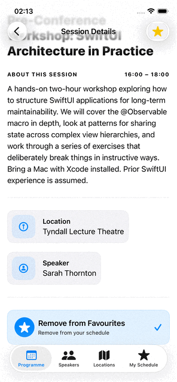 | 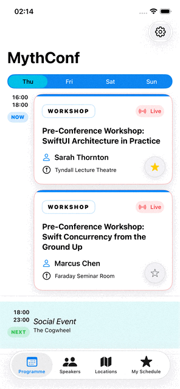 |

## Automated Verification

**Benefit for judges and maintainers:** accessibility improvements are backed by repeatable checks, so future UI changes are less likely to silently break labels, hit regions, traits, or time-sensitive behavior.

The project uses two complementary accessibility verification layers:

1. Static accessibility linting with `a11y-check`.
2. Runtime UI auditing with XCTest `performAccessibilityAudit`.

The reason for using both is user protection. `a11y-check` is fast and catches source-level issues early, such as missing labels, poor traits, and small touch targets. `performAccessibilityAudit` runs the actual app UI and can catch runtime problems such as hit regions, element detection, traits, descriptions, and contrast in real screens.

### Static Accessibility Linting

`a11y-check` acts as a build-time accessibility guard so obvious SwiftUI accessibility regressions are caught during development rather than only during manual review.

Run from the repository root:

```sh
a11y-check MythConf/MythConf26 --format json --per-view --no-trend
```

This is useful before submitting the PR because it gives a quick source-level pass over the SwiftUI views.

### Real Conference-Day States With Injected Dates

The app uses [Point-Free's Dependencies](https://github.com/pointfreeco/swift-dependencies) library to inject the current date into the `ViewModel`.

That matters because many accessibility improvements are time-dependent:

- Status badges: hidden, Starting Soon, Starting in Xm, Live, Ended.
- Now/Next chips.
- Spoken time status for VoiceOver.
- Local notification scheduling.
- Preventing reminders for sessions that already ended.
- My Schedule ordering and current-day context.

Instead of hard-coding `Date()` throughout the app, the view model reads `@Dependency(\.date)`. When the app is launched with `-TestingDate`, the app converts that timestamp into a real `Date`, calculates an offset from the current system clock, and injects a date generator that keeps moving forward from that conference moment.

This is better than freezing a static date because the simulator behaves like a live conference day. If the selected argument is the second day of the conference, judges can immediately see what a real attendee would see on that day: previous sessions marked Ended, the current row marked Now/Live, later sessions marked upcoming, countdowns changing over time, and reminder logic using the same clock as the UI.

Example launch arguments:

```sh
-TestingDate 841581000   # before first workshop status appears
-TestingDate 841582320   # countdown state, for example Starting in 8m
-TestingDate 841582800   # live state
-TestingDate 841646100   # second conference day, showing ended/live/upcoming mix
```

### Runtime UI Accessibility Audits

The project also includes a UI test target that exercises accessibility-sensitive behavior with Apple's XCTest accessibility audit API.

Run from the repository root:

```sh
xcodebuild -project MythConf/MythConf26.xcodeproj -scheme MythConf26 -destination 'platform=iOS Simulator,name=iPhone 17' test
```

Covered areas include:

- XCTest accessibility audits for major screens.
- Settings controls.
- Favourite add/remove semantics.
- Session Details structure.
- Session status badge timing.
- Local notification scheduling.
- VoiceOver-facing labels such as "Sessions by [speaker name]".

Some XCTest audit checks remain manual because current simulator tooling is noisy or timing-sensitive:

- Largest Dynamic Type visual review.
- Real VoiceOver rotor behavior.
- On/Off Labels, Button Shapes, Reduce Transparency, Reduce Motion, Differentiate Without Color, and grayscale visual review.
- Siri on device.
- Haptics and sounds on physical hardware.
- Switch Control and Full Keyboard Access scan/order passes.

## Final Note

The goal was not to add accessibility as a layer on top of the app. The goal was to make the same conference tasks easier through multiple input and output modes: touch, keyboard, switch, VoiceOver, Voice Control, Siri, sound, haptics, notifications, and readable visual design.
